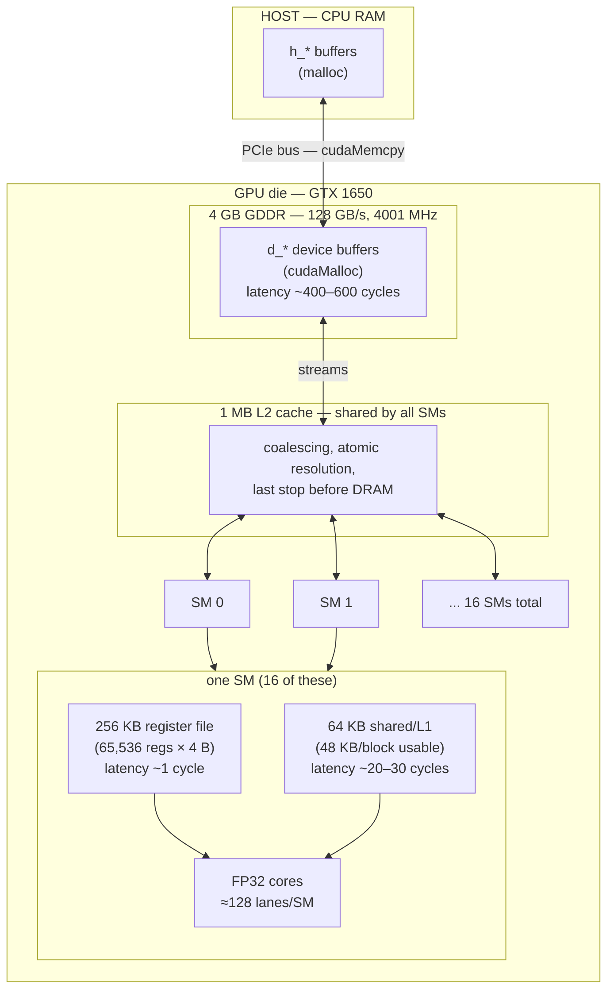

# GPU Hardware Reference — NVIDIA GeForce GTX 1650 (sm_75, Turing)

**Purpose**: one-page refresher on the chip, its memory hierarchy, and the
numbers that drive every design decision. All device numbers are MEASURED from
`src/cuda/gpu_check.cu` on this machine. Latency figures are typical
Turing-era approximations (tens of cycles, rounded) — use them as order-of-magnitude,
not spec-sheet exact.

---

## 1. The whole chip, at a glance

```
┌──────────────────────────  BC  GPU die (GTX 1650) ──────────────────────────┐
│                                                                             │
│  ┌────────── SM 0 ─────────┐   ┌────────── SM 1 ─────────┐    ... 16 SMs    │
│  │  1024 resident threads  │   │  1024 resident threads  │                  │
│  │  (32 warps)             │   │                        │                  │
│  │                         │   │                        │                  │
│  │  256 KB register file   │   │  256 KB register file   │                  │
│  │  64 KB shared/L1 (unified)│  │                        │                  │
│  │                         │   │                        │                  │
│  │  FP32 cores ──┐         │   │                        │                  │
│  └───────────────┼─────────┘   └────────────────────────┘                  │
│                  │                                                         │
│        ┌─────────┴───────────  1 MB L2 cache (shared by ALL SMs) ─────────┐ │
│        │  coalescing, atomic resolution, last stop before DRAM            │ │
│        └───────────────────────────────────────────────────────────────────┘ │
│                  │                                                         │
│       ┌──────────▼────────  4 GB GDDR DRAM (128 GB/s, 4001 MHz) ──────────┐ │
│       │  the only "big" memory — everything else is tiny and fast          │ │
│       └─────────────────────────────────────────────────────────────────────┘ │
│                                                                             │
│  ─── PCIe bus ───► host CPU RAM (your h_* buffers live here)                │
└─────────────────────────────────────────────────────────────────────────────┘
```

**Mermaid version** (renders in GitHub/VSCode markdown preview):



---

## 2. The memory hierarchy, by distance

| Level | Size | Approx latency | Access | Who can see it |
|---|---|---|---|---|
| **Registers** | 256 KB/SM (65,536 × 4 B) | 0–1 cycle | ultra-fast | ONE thread only |
| **Shared / L1** | 64 KB/SM (48 KB/block usable) | ~20–30 cycles | fast, on-chip | threads of ONE block |
| **L2 cache** | 1 MB (whole die) | ~200 cycles | medium, on-chip | ALL SMs |
| **DRAM** | 4 GB, 128 GB/s | ~400–600 cycles | slow, off-chip | everyone (global mem) |
| **Host RAM** | (CPU side) | microseconds away | PCIe transfer | CPU + via copy |

**Key facts to internalize**
- Registers are **private to one thread** — that's why reductions must move
  values into shared before combining. No thread can read another's register.
- Shared is **private to one block** — block 0 and block 1 on different SMs
  cannot share; that's why whole-array reductions need a second kernel stage.
- DRAM is where `x[n]` lives; you stream it once, do all the math on
  registers/shared, write the result back once — that's the whole optimization
  playbook (fusing, tiling).

---

## 3. Chip specs — MEASURED (gpu_check)

| Property | Value |
|---|---|
| Compute capability | 7.5 (sm_75, Turing) |
| SMs | 16 |
| Max threads / SM | 1,024 (= 32 warps of 32) |
| Max threads / block | 1,024 |
| Registers / SM | 65,536 |
| Shared / block | 49,152 B (48 KB) |
| Shared / SM | 65,536 B (64 KB) |
| Max blocks / SM | 16 |
| L2 cache | 1 MB |
| DRAM | 4 GB |
| Memory bandwidth | 128 GB/s |
| Core clock | 1560 MHz |
| Memory clock | 4001 MHz |
| Bus width | 128 bits |
| Warp size | 32 |
| FP32 throughput (derived) | ≈ 16 SM × 64 lanes × 2 FMA × 1.56 GHz ≈ **3.2 TFLOPS** |
| Roofline ridge point | 3.2e12 FLOP/s ÷ 128e9 B/s ≈ **25 FLOP/byte** |

> Below the ridge: memory-bound. Above: compute-bound. (See
> `docs/cuda_ml_curriculum.md` roofline section if you need the refresher.)

---

## 4. Register math (the "64" explained once, forever)

```
register file size = 65,536 registers/SM × 4 bytes = 256 KB/SM

register budget at FULL occupancy = 65,536 ÷ 1,024 threads = 64 regs/thread
                                                                   ↑ this "64"
```

- Lab 1 kernel used **24 registers** → full 1024 threads fit. If a kernel needs
  128 → only 512 threads/SM fit → occupancy halves → latency hiding halves.
- ptxas prints your register count: `--ptxas-options=-v` every build.

---

## 5. Occupancy formula (resident threads/SM)

```
resident threads = min(
     1024,                        ← max threads/SM
     65536 ÷ regs_per_thread,     ← register file budget
     65536 ÷ shared_bytes/block,  ← shared budget (per block)
     16 × threads_per_block       ← max block count
)
```

Every limit you hit is a resource you priced wrong. Lab 1 hit "1024";

---

## 6. Memory families (the h_/d_ rules)

| Family | Allocator | Lives in | Kernel can touch? | Host can touch? |
|---|---|---|---|---|
| `h_*` | `malloc` | host RAM | NO (illegal access) | YES |
| `d_*` | `cudaMalloc` | device DRAM | YES | NO |
| managed | `cudaMallocManaged` | unified, migrated | YES | YES |

- `cudaMemcpy` is the ONLY bridge between families.
- Kernel arguments are ALWAYS `d_*`.
- `cudaMalloc` = eager (fails at call); `cudaMallocManaged` = lazy (pages on
  first touch).
- On this WSL2 box managed memory degrades to zero-copy host RAM
  (`concurrentManagedAccess = 0`) — prefetch is broken, use explicit copies.

---

## 7. Key API signatures (quick recall)

```cuda
cudaMalloc(&d_ptr, bytes);
cudaMemcpy(dst, src, bytes, cudaMemcpyHostToDevice | cudaMemcpyDeviceToHost);
cudaFree(d_ptr);
cudaMemset(d_ptr, 0, bytes);
cudaEventCreate(&ev); cudaEventRecord(ev, 0); cudaEventSynchronize(ev);
cudaEventElapsedTime(&ms, start, stop);
cudaDeviceSynchronize();
cudaGetDeviceProperties(&prop, 0);
```

---

## 8. The mental model in one sentence

**Stream data from DRAM once into registers/shared, multiply how many times
you can while it's hot, and never touch DRAM again until the final store.**
The chip's size hierarchy — 256 KB/SM registers, 64 KB/SM shared, 1 MB L2,
4 GB DRAM — is the physics that makes every kernel decision.