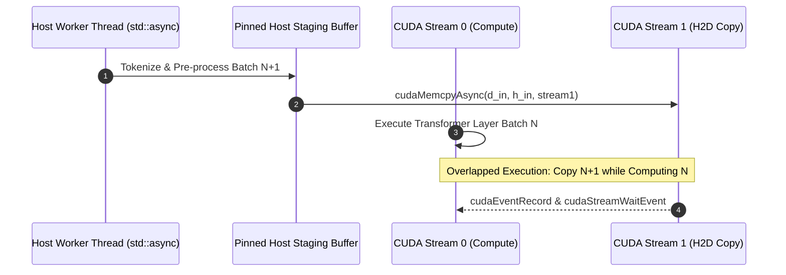

# Module 2.5: Host Parallel Execution, Asynchronous Pipelines, and CPU-GPU Co-Design

In production high-performance machine learning frameworks (e.g., PyTorch ATen, vLLM, TensorRT-LLM, FlashAttention runners), the GPU does not operate in a vacuum. The host CPU orchestrates data loading, tokenization, dynamic batch scheduling, KV-cache index management, and stream synchronization.

Understanding both **multi-threaded CPU parallel computation** and **asynchronous host-device pipelines** is vital to eliminating host-bound bottlenecks that starve GPU streaming multiprocessors (SMs).

---

## 1. Multi-Threaded Host Parallelism: Why Custom Chunked Parallelism Over `<execution>`?

While C++17 introduced `<execution>` (`std::execution::par`), its implementation in GCC/Clang on Linux typically delegates to external runtimes like Intel TBB or OpenMP. In production GPU environments, this introduces runtime shared-library ABI conflicts (`libtbb.so` vs CUDA runtime) and opaque thread scheduling that cannot be pinned to specific NUMA nodes or CPU sockets.

Consequently, modern C++ deep learning engines build lightweight, zero-dependency parallel execution primitives using standard C++ `<thread>`, `<future>`, and atomic work-stealing/chunking:

```cpp
template <typename IndexType, typename Func>
void parallel_for(IndexType start, IndexType end, size_t num_threads, Func&& fn) {
    IndexType total = end - start;
    IndexType chunk_size = (total + num_threads - 1) / num_threads;
    std::vector<std::thread> workers;

    for (size_t t = 0; t < num_threads; ++t) {
        IndexType s = start + t * chunk_size;
        IndexType e = std::min(s + chunk_size, end);
        if (s < e) {
            workers.emplace_back([s, e, &fn]() {
                for (IndexType i = s; i < e; ++i) {
                    fn(i);
                }
            });
        }
    }
    for (auto& w : workers) w.join();
}
```

---

## 2. Multi-Threaded Parallel Reduction

Parallel reduction splits an array into contiguous chunks across host threads. Each thread computes a local partial reduction, and the main thread accumulates the partial results into the final scalar:

$$\text{Total} = \bigoplus_{t=0}^{P-1} \left( \bigoplus_{i=\text{start}_t}^{\text{end}_t} x_i \right)$$

This scales linearly with CPU cores and provides an analytical ground-truth baseline to validate GPU reductions.

---

## 3. CPU vs GPU Architectural Trade-Offs

| Dimension | Modern Multi-Core Host CPU | Modern NVIDIA GPU (Turing, Ampere, Hopper) |
| :--- | :--- | :--- |
| **Core Architecture** | 8–128 heavy cores, huge out-of-order execution, deep branch predictors | Thousands of lightweight SIMT cores organized into SMs |
| **Memory Bandwidth** | DDR4/DDR5: ~50–120 GB/s | GDDR6 / HBM3: ~300–3,300 GB/s |
| **Optimal Workload** | Low-latency branch-heavy logic, string tokenization, dynamic graph dispatch | Massive data-parallel compute: GEMM, Softmax, RMSNorm, Attention |
| **Launch Latency** | Sub-microsecond function dispatch | 3–15 $\mu$s kernel launch overhead |

---

## 4. Asynchronous Host Pipelines & Multi-Stream Overlap

To achieve 100% GPU saturation, host threads prepare batch $N+1$ in parallel while the GPU computes batch $N$.



### Pinned Memory Requirement
Asynchronous host-to-device transfers (`cudaMemcpyAsync`) only overlap with compute kernels if the host buffer is **page-locked (pinned)** via `cudaHostAlloc` or `cudaMallocHost`. Regular pageable memory forces the CUDA driver to copy data to an internal pinned staging buffer synchronously before initiating DMA.

---

## 5. Precise High-Resolution Benchmarking

Host CPU clocks (`std::chrono::high_resolution_clock`) measure wall-clock CPU time. However, because CUDA kernel launches are asynchronous, host timers will only record the submission latency unless explicitly synchronized.

```cpp
// Correct GPU Event Benchmarking
cudaEvent_t start, stop;
cudaEventCreate(&start);
cudaEventCreate(&stop);

cudaEventRecord(start, stream);
my_kernel<<<grid, block, 0, stream>>>(...);
cudaEventRecord(stop, stream);

cudaEventSynchronize(stop);
float elapsed_ms = 0.0f;
cudaEventElapsedTime(&elapsed_ms, start, stop);

cudaEventDestroy(start);
cudaEventDestroy(stop);
```
